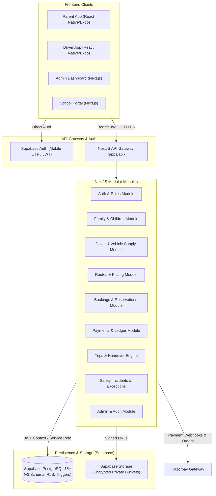

# TinyRide — System Architecture & Technical Specification
**Platform:** TinyRide by Dodail  
**Company:** Dodail Solutions Private Limited  
**Target Market:** Hyderabad, Telangana, India  
**Architecture Style:** Modular Monolith (Backend) + Shared Monorepo Packages + Multi-Client UI  

---

## 1. High-Level Architecture

TinyRide is engineered as a secure, high-integrity school transportation platform connecting parents with independently operated school auto and van drivers.



---

## 2. Monorepo Structure

We employ a **pnpm workspaces** monorepo layout:

```
tinyride/
├── apps/
│   ├── api/                  # NestJS Modular Monolith
│   ├── parent-mobile/        # React Native + Expo Parent App
│   ├── driver-mobile/        # React Native + Expo Driver & Owner App
│   ├── admin-web/            # Next.js Admin Operations Console
│   └── school-web/           # Next.js School Staff & Admin Portal
├── packages/
│   ├── shared-types/         # Shared TypeScript domain models & DTO interfaces
│   ├── shared-validation/    # Zod / class-validator schemas & business rules
│   ├── design-system/        # Brand colors, typography, UI primitives
│   └── api-client/           # Typed client SDK generated from OpenAPI spec
├── sql/                      # Canonical PostgreSQL database DDL (00 to 10)
├── test/                     # Local database harness & smoke tests
└── docs/                     # Architectural specs, audits, and operational manuals
```

---

## 3. Database Architecture & Invariants

The data tier is structured across three PostgreSQL schemas:
1. `public`: All domain entities exposed to clients subject to Row Level Security.
2. `app`: Internal helper functions, stored procedures (`reserve_seat`, `generate_trips_for_date`), and state machine triggers. Unexposed to PostgREST.
3. `archive`: Cold storage partition schema for aged audit trails and historical trip telemetry.

### 3.1. Unified State Machine Engine
Rather than fragmented status columns, all lifecycles (`profile`, `driver`, `vehicle`, `route`, `booking`, `subscription`, `payment`, `payout`, `trip`, `trip_child`, `incident`, `exception`, `ticket`, `reassignment`) are governed by:
- `public.states`: Lookup table defining `(domain, code)`, sort order, failure flag, terminal flag, and UI brand colors.
- `public.state_transitions`: Authorized `(domain, from_code, to_code)` pairs with role permissions.
- `app.enforce_state_machine()`: Trigger rejecting invalid transitions at the database level.

### 3.2. Seat Allocation & Anti-Oversell
Overselling is physically prevented through pessimistic concurrency:
- Every `route_schedule` possesses a `schedule_seat_counters` record.
- When reserving a seat, `app.reserve_seat(p_child_id, p_schedule_id, p_hold_minutes)` executes:
  1. `SELECT ... FROM schedule_seat_counters WHERE schedule_id = ... FOR UPDATE;`
  2. Asserts `seats_taken + p_seats <= seats_offered`.
  3. Inserts into `public.seat_holds` with a 10-minute expiry timestamp.
  4. Returns the hold record.
- Unconverted holds are cleared automatically by scheduled background sweeps.

### 3.3. Financial Ledger Model
Payments use an append-only, double-entry ledger in **minor units (paise)**:
- Accounts: `parent_receivable`, `platform_revenue`, `gateway_clearing`, `owner_payable`, `cash`.
- Every transaction creates balanced credit and debit rows in `public.ledger_entries`.
- Mutation or deletion is blocked by `app.forbid_mutation()`.

---

## 4. Authentication & Security Architecture

### 4.1. Authentication Flow
1. User provides mobile phone number in international format (`+91XXXXXXXXXX`).
2. Supabase Auth generates a 6-digit SMS OTP.
3. Upon OTP verification, Supabase issues a cryptographically signed JWT.
4. Client passes `Authorization: Bearer <token>` on all NestJS REST API calls.

### 4.2. NestJS Guard Hierarchy
Every protected NestJS endpoint evaluates a multi-layered guard pipeline:
1. `SupabaseAuthGuard`: Validates the JWT signature against Supabase public keys and extracts `auth.uid()`.
2. `ProfileGuard`: Resolves `public.profiles` and ensures the profile is in `active` state.
3. `RolesGuard`: Verifies that the user has an active, unrevoked role in `public.user_roles` matching `@Roles(...)`.
4. `EntityOwnershipGuard`: Asserts that parents access only their own children, drivers access only today's assigned trips, and schools access only their student roster.

### 4.3. Row Level Security (RLS)
The database enforces **default-deny** across all tables (`ALTER TABLE ... FORCE ROW LEVEL SECURITY`).
- `SECURITY DEFINER` functions (`app.current_parent_id()`, `app.drives_trip()`, `app.owns_child()`) prevent policy recursion.
- Privileged operations (financial journal entries, KYC approvals, state overrides) are restricted to NestJS server-side execution with service credentials.

---

## 5. Child Handover & Safety Architecture

The safety engine enforces a strict multi-actor state machine:

```
[ Scheduled ]
      │
      ▼ (Driver completes readiness check)
   [ Ready ]
      │
      ▼ (Driver starts morning run)
 [ In Progress ]
      │
      ├──> [ Home Pickup ]: Driver requests OTP from Parent/Guardian.
      │                     Parent supplies 4-digit code.
      │                     NestJS validates hashed token -> records 'pickup_confirmed'.
      │
      ├──> [ School Arrival ]: Driver marks arrived.
      │                        Authorized School Staff confirms receipt -> records 'school_received'.
      │
      ├──> [ School Release ]: Afternoon run.
      │                        School staff verifies driver & vehicle -> confirms release -> 'school_released'.
      │
      └──> [ Home Dropoff ]: Driver requests OTP from authorized Parent/Guardian.
                             OTP verified -> records 'dropoff_confirmed'.
      │
      ▼ (All assigned children accounted for)
 [ Completed ]
```

### Safety Rules:
- **No GPS-Only Handover**: GPS proximity is never accepted as handover proof. An OTP or verified school confirmation is mandatory.
- **Trip Closure Guard**: A trip cannot transition to `completed` if any child remains in an unresolved handover state.
- **Human Exception Resolution**: Mismatches, expired OTPs, or unapproved driver substitutions trigger an `exception` record with an SLA timer. AI models are strictly prohibited from approving handovers or closing safety exceptions.

---

## 6. Brand Guidelines & Design Tokens Integration

The design system incorporates the official TinyRide tokens:

| Token Name | Hex Value | Application |
|---|---|---|
| `brand-green` | `#0A9C49` | Primary Brand, Success Badges, Approved State |
| `brand-navy` | `#012646` | Primary Headings, High-Contrast Text |
| `brand-deep-blue`| `#022D53` | Secondary Brand, Navigation, Header Backgrounds |
| `brand-sun-gold` | `#FEA707` | Warnings, Pending Review, Mascot Highlights |
| `surface-bg` | `#FFFFFF` | Primary Content Background |
| `surface-subtle`| `#F4F7F9` | Secondary Cards, App Backgrounds |
| `border-subtle` | `#D7E1E8` | Input & Card Borders |
| `action-primary`| `#067A3A` | Primary Button Fill |
| `action-hover` | `#055F2E` | Button Hover & Pressed State |
| `accent-surface`| `#FFF4D6` | Warning Banners & Pending Notice Containers |

---

## 7. NestJS API Architecture

The backend monolith is structured into domain-specific modules:

```
apps/api/src/
├── app.module.ts              # Root composition module
├── main.ts                    # Bootstrap with Swagger, validation pipe, Pino
├── common/
│   ├── config/                # Validated environment configuration (zod)
│   ├── decorators/            # @CurrentUser(), @Roles(), @Public()
│   ├── filters/               # Global HttpException & DatabaseError filters
│   ├── guards/                # SupabaseAuthGuard, RolesGuard, OwnershipGuard
│   ├── interceptors/          # Logging, CorrelationId, TransformResponse
│   └── supabase/              # SupabaseClientFactory (Service Role & User scoped)
└── modules/
    ├── auth/                  # Phone OTP login, profile resolution, session
    ├── parents/               # Parent profile, family management
    ├── children/              # Child registry, health notes, guardians
    ├── drivers/               # Driver onboarding, documents, KYC submission
    ├── vehicle-owners/        # Owner profile, vehicle registration
    ├── vehicles/              # Fleet management, document verification
    ├── schools/               # School registry, student verification, staff
    ├── routes/                # Route proposals, stops, schedules, pricing
    ├── bookings/              # Seat hold reservations, booking lifecycle
    ├── payments/              # Razorpay orders, webhooks, double-entry ledger
    ├── trips/                 # Daily trip generator, manifest, state machine
    ├── handovers/             # OTP generation, hashing, verification
    ├── exceptions/            # Operational exceptions with SLA tracking
    ├── incidents/             # Safety incident reporting & evidence
    ├── notifications/         # Multi-channel push/SMS dispatch
    ├── admin/                 # KYC review queues, route approvals, metrics
    └── audit/                 # Append-only audit logger
```
