# TinyRide — Comprehensive Multi-Phase Implementation Plan
**Platform:** TinyRide by Dodail  
**Company:** Dodail Solutions Private Limited  
**Stack:** TypeScript Monorepo (pnpm) · NestJS Modular Monolith · Supabase PostgreSQL · React Native / Expo · Next.js  
**Target Release:** Hyderabad Pilot MVP  

---

## Roadmap Overview

```mermaid
flowchart LR
    P0["Phase 0\nAudit & Plan"] --> P1["Phase 1\nFoundation & NestJS"]
    P1 --> P2["Phase 2\nAuth & Security"]
    P2 --> P3["Phase 3\nDriver & Supply"]
    P3 --> P4["Phase 4\nParent & Booking"]
    P4 --> P5["Phase 5\nTrips & Safety Handover"]
    P5 --> P6["Phase 6\nAdmin Dashboard"]
    P6 --> P7["Phase 7\nSchool Portal"]
    P7 --> P8["Phase 8\nStabilization & E2E"]
    P8 --> P9["Phase 9\nProduction Deployment"]
```

---

## Phase Breakdown & Deliverables

### Phase 0: Repository Audit & Technical Discovery *(Completed)*
- [x] Inspect existing repository, directory structure, environment files, and tools.
- [x] Analyze v3 database schema across all 11 SQL migration files (`00` to `10`).
- [x] Incorporate TinyRide brand assets, logo, mascot, and official 9-step color ramps.
- [x] Generate `docs/PROJECT_AUDIT.md`, `docs/ARCHITECTURE.md`, and `docs/OPEN_DECISIONS.md`.
- [x] Formulate master `docs/IMPLEMENTATION_PLAN.md` and obtain approval.

---

### Phase 1: Foundation & Backend Scaffolding *(Completed & Verified)*
**Goal:** Establish the pnpm monorepo workspace, shared packages, and the NestJS backend foundation with robust configurations, structured logging, OpenAPI documentation, and database connectivity.

**Deliverables:**
1. **Workspace Setup:**
   - [x] Root `package.json` with pnpm workspace definition (`pnpm-workspace.yaml`).
   - [x] Root TypeScript config (`tsconfig.base.json`).
2. **Shared Packages:**
   - [x] `packages/shared-types`: Canonical TypeScript interfaces for entities, states, enums, and API contracts.
   - [x] `packages/design-system`: TinyRide brand tokens (Green `#0A9C49`, Navy `#012646`, Gold `#FEA707`, Deep Blue `#022D53`), typography, and 9-step ramps.
   - [x] `packages/shared-validation`: Common Zod schemas (phone numbers, E.164, license numbers, handover payloads).
3. **NestJS Modular Monolith (`apps/api`):**
   - [x] Initialized NestJS app with `AppModule`.
   - [x] `ConfigModule` with strict Zod environment variable validation (`PORT`, `SUPABASE_URL`, `SUPABASE_ANON_KEY`, `SUPABASE_SERVICE_ROLE_KEY`, `CORS_ORIGINS`).
   - [x] `SupabaseModule` providing injectable client services (user-scoped JWT client and privileged service-role client).
   - [x] Structured JSON logging using NestJS Pino / correlation ID middleware.
   - [x] Global HTTP exception filter with unified RFC 7807 error format.
   - [x] OpenAPI / Swagger documentation configured at `/api/docs`.
   - [x] Health and Readiness probes (`/health/liveness`, `/health/readiness`).
4. **Verification Gate:**
   - [x] Monorepo compiles cleanly (`pnpm build` across all 4 projects: 0 errors).
   - [x] Unit tests pass: 3 test suites, 7 tests passed (100%).
   - [x] E2E integration tests pass: `/health/liveness` returns 200 OK with brand metadata; 404 handler returns RFC 7807 payload with correlation ID header.

---

### Phase 2: Authentication & Authorization Engine *(Completed & Verified)*
**Goal:** Implement server-side Supabase JWT verification, role-based authorization, profile lifecycle synchronization, and access-isolation tests.

**Deliverables:**
1. **Auth & Identity Module (`apps/api/src/modules/auth`):**
   - [x] `SupabaseAuthGuard`: Validates bearer JWT, extracts `sub` claim, and attaches user identity to request context.
   - [x] `AuthService`: Resolves `public.profiles` and live roles from `public.user_roles`.
   - [x] Mobile OTP endpoints: `POST /auth/otp/send` and `POST /auth/otp/verify`.
   - [x] Protected profile context endpoint: `GET /auth/me`.
2. **Role & Permission Guards (`apps/api/src/common/guards`):**
   - [x] `@Roles(...)` metadata decorator supporting all 9 roles:
     `parent`, `driver`, `vehicle_owner`, `school_staff`, `operator`, `kyc_reviewer`, `finance_admin`, `support_agent`, `admin`.
   - [x] `RolesGuard`: Enforces active, unrevoked role checks against the database with admin override.
   - [x] `ParentOwnershipGuard`: Prevents cross-family child and booking data exposure.
3. **Audit Logging Service (`apps/api/src/modules/audit`):**
   - [x] Ingestion service recording privileged administrative actions and state changes into `public.audit_logs`.
4. **Verification Gate:**
   - [x] Unit test suite: 8 test suites, 29 tests passed (100%).
   - [x] End-to-end integration tests: 2 suites, 6 tests passed (100%).
   - [x] Verified scenarios: rejection of invalid/expired JWTs, public route bypass, suspended account rejection, role enforcement (driver cannot access parent routes), and cross-tenant data isolation (parent A cannot view parent B's children).

---

### Phase 3: Driver & Vehicle Supply *(Completed & Verified)*
**Goal:** Implement driver onboarding, KYC document submission, vehicle registration, owner-driver authorization, route proposals, and reviewer workflows.

**Deliverables:**
1. **Driver Profile & Onboarding (`apps/api/src/modules/drivers`):**
   - [x] Profile creation with license details, address, and city assignment in `pending_verification`.
   - [x] Document upload endpoint generating signed URLs for private Supabase storage.
   - [x] Document metadata tracking (expiry dates, document type: license, police verification, etc.).
2. **Vehicle Owners & Fleet Management (`apps/api/src/modules/vehicles`):**
   - [x] Vehicle owner registration (PAN/GSTIN, legal name, payout account token).
   - [x] Vehicle registration with seating and usable capacity constraints (anti-overcrowding invariant).
   - [x] Driver-vehicle assignment requests with owner authorization audit.
3. **Route Proposal Engine (`apps/api/src/modules/routes`):**
   - [x] Route creation with stops, GPS coordinates, geocoded service area, and school association.
   - [x] Schedule definitions (`Morning Run`, `Afternoon Run`, departure/arrival times, seats offered).
   - [x] Price tiers (`route_prices`) in minor units (paise).
   - [x] Verified schedule driver-vehicle assignment with capacity & approval guards.
4. **KYC Review & Approval Queues (`apps/api/src/modules/admin/kyc`):**
   - [x] Review queues for drivers, vehicles, and routes.
   - [x] Review decision endpoint for KYC reviewers (`approve`, `reject`, `needs_info` with mandatory reason codes).
   - [x] State transitions for drivers, vehicles, and routes (`pending_verification` -> `approved`) with audit logs.
5. **Verification Gate:**
   - [x] Unit test suite: 12 test suites, 43 tests passed (100%).
   - [x] End-to-end integration tests: 3 suites, 10 tests passed (100%).
   - [x] Verified safety invariants: unapproved drivers cannot be assigned to schedules, unapproved vehicles cannot be assigned, vehicle usable capacity cannot exceed seating capacity, schedule seats offered cannot exceed vehicle usable capacity, and unverified owners cannot authorize driver assignments.

---

### Phase 4: Parent Experience, Booking & Payments [COMPLETED]
**Goal:** Implement parent family registration, child profiles, school/stop selection, route discovery, seat reservations, and Razorpay payment integration.

**Deliverables:**
1. **Family Management (`apps/api/src/modules/parents`):**
   - [x] Parent profile creation and retrieval (`GET /api/v1/parents/me`).
   - [x] Multi-child registry (`POST /api/v1/parents/children`, `GET /api/v1/parents/children`, `GET /api/v1/parents/children/:childId`) enforcing DOB checks, school validation, and health/allergy notes.
   - [x] Authorized guardian registry (`POST /api/v1/parents/children/:childId/guardians`, `GET /api/v1/parents/children/:childId/guardians`) with pickup authorization and parent tenant isolation.
2. **Route Discovery & Discovery API:**
   - [x] Search routes by school ID, residential zone, or public discovery (`GET /api/v1/routes`).
   - [x] Schedule seat availability check against `schedule_seat_counters`.
3. **Booking & Seat Allocation Engine (`apps/api/src/modules/bookings`):**
   - [x] Transactional seat reservation calling `app.reserve_seat()` / capacity fallback (`POST /api/v1/bookings/reserve`) with 10-minute hold.
   - [x] Booking creation in `awaiting_payment` state (`POST /api/v1/bookings`, `GET /api/v1/bookings`, `GET /api/v1/bookings/:bookingId`).
   - [x] Cancellation flow with reason codes (`POST /api/v1/bookings/:bookingId/cancel`) releasing holds and capacity counters.
   - [x] Concurrency and capacity tests verifying zero oversell.
4. **Payments & Double-Entry Ledger (`apps/api/src/modules/payments`):**
   - [x] Razorpay Order creation for booking amount (`POST /api/v1/payments/order`).
   - [x] Public webhook handler verifying HMAC SHA256 signature (`POST /api/v1/payments/webhook/razorpay`).
   - [x] Idempotent payment processing updating booking state to `confirmed`.
   - [x] Balanced double-entry journal entries in minor units (`gateway_clearing` debit, `platform_revenue` 15% credit, `owner_payable` 85% credit; sum = 0).
5. **Verification Gate:**
   - [x] 100% test pass rate: 15 unit suites (58/58 tests passed), 4 e2e test suites (16/16 tests passed).
   - [x] Zero oversell capacity check verified.
   - [x] Tampered/invalid webhook signatures rejected with 401 Unauthorized.
   - [x] Cross-tenant data isolation verified via `ParentOwnershipGuard` (403 Forbidden).

---

### Phase 5: Daily Trips, Handover Safety & State Machine [COMPLETED]
**Goal:** Implement daily trip generation, driver execution manifests, multi-leg OTP handover verification, and real-time operational alerts.

**Deliverables:**
1. **Trip Generation & Manifest Engine (`apps/api/src/modules/trips`):**
   - [x] Execution of schedule candidate selection, holiday exclusion, and absence filtering for scheduled routes (`POST /api/v1/trips/generate`).
   - [x] Driver manifest endpoint returning only assigned children for the current day (`GET /api/v1/trips/manifest/today`, `GET /api/v1/trips/:tripId/manifest`).
   - [x] Parent absence reporting (`child_absences`) excluding absent children from the manifest (`POST /api/v1/trips/absences`).
2. **Trip State Machine:**
   - [x] State progression: `scheduled` -> `ready` -> `in_progress` -> `completed` (`PATCH /api/v1/trips/:tripId/state`).
   - [x] Readiness checks (checklist notes, driver confirmation).
   - [x] Safety completion invariant: trip cannot transition to `completed` if uncompleted child handovers remain without approved exceptions.
3. **Child Handover Verification Engine (`apps/api/src/modules/handovers`):**
   - [x] **Home Pickup Leg:** Driver requests OTP; parent provides code; NestJS validates hashed token; records `picked_up` event and advances child state.
   - [x] **School Arrival Leg:** Driver records arrival; authorized school staff confirms receipt (`at_school`).
   - [x] **School Release Leg:** School verifies driver/vehicle; authorizes release (`released_from_school`).
   - [x] **Home Dropoff Leg:** Driver requests OTP from authorized guardian; token validated; records `dropped_off`.
   - [x] Salted HMAC-SHA256 tokens with 15-minute TTL, attempt auditing, and 3-attempt lockout with auto-exception raising.
4. **Safety Exceptions & Incident Workflows (`apps/api/src/modules/safety`):**
   - [x] Automated exception creation for failed OTP, excessive delay, or unconfirmed school receipt (`POST /api/v1/safety/exceptions`).
   - [x] SLA timers dynamically derived from severity (`critical` = 60m, `high` = 240m, `medium` = 1440m, `low` = 4320m).
   - [x] Incident reporting with formatted references (`INC-YYYYMMDD-XXXXXX`), severity, and closure workflow requiring non-empty closure note and authorized approver.
5. **Verification Gate:**
   - [x] Wrong OTP or expired OTP rejected.
   - [x] Lockout triggered after 3 failed OTP attempts with automatic safety exception.
   - [x] Trip cannot be completed while any child has unresolved handover.
   - [x] 100% test pass rate across unit tests (18 suites, 69 tests) and e2e integration tests (5 suites, 22 tests).

---

### Phase 6: Admin Operations Dashboard [COMPLETED]
**Goal:** Build the Next.js Admin Web Console for platform operations, KYC verification, trip monitoring, incident handling, and financial reconciliation.

**Deliverables:**
1. **Next.js Admin Application (`apps/admin-web`):**
   - [x] Secure operational console with role switching and enforcement (`admin`, `operator`, `kyc_reviewer`, `finance_admin`).
   - [x] Responsive layout shell (`AdminShell`) using TinyRide design system tokens (Green `#0A9C49`, Navy `#012646`, Gold `#FEA707`, Deep Blue `#022D53`).
2. **Operations Modules & Web Desks:**
   - [x] **KYC & Document Review (`/kyc`):** Side-by-side inspection for commercial DL, police clearances, vehicle RC; decision modals with mandatory reason codes (`DOC_EXPIRED`, `UNREADABLE`, `INCOMPLETE`, `APPROVED`).
   - [x] **Live Fleet Monitor (`/trips`):** Live monitoring across Hyderabad, trip phase badges, handover completion rates, and delay indicators.
   - [x] **Safety & Exception Triage (`/safety`):** SLA countdown timers, triage modal with mandatory resolution code, and formal incident logs with human auditor closure notes.
   - [x] **Finance & Ledger Reconciliation (`/finance`):** Double-entry ledger audit table, 0-discrepancy balance verification banner, 15% platform commission vs 85% owner payable breakdowns, and payout settlement triggers.
   - [x] **Support Desk (`/support`):** Ticket-scoped parent/driver inquiry queue, severity priority tags, and state progression (`open` -> `in_progress` -> `resolved` -> `closed`).
3. **Backend Admin Extensions (`apps/api`):**
   - [x] `OpsModule`: Real-time `/admin/ops/overview` and `/admin/ops/trips/live` endpoints.
   - [x] `FinanceModule`: Real-time `/admin/finance/reconciliation` double-entry ledger audit.
   - [x] `SupportModule`: Ticket queue `/admin/support/tickets` and state management.
4. **Verification Gate:**
   - [x] Unit test suite: 21 test suites passed, 78 tests passed (100%).
   - [x] End-to-end integration suite: 6 test suites passed, 28 tests passed (100%).
   - [x] Next.js production build: 9 static pages generated, 0 compile errors.
   - [x] Live servers running: NestJS API on port 3000, Next.js Admin Console on port 3001.

---

### Phase 7: School Portal [COMPLETED]
**Goal:** Build the dedicated Next.js School Web Portal for student roster verification, morning arrival receipt, afternoon release authorization, and exception reporting.

**Deliverables:**
1. **School Web Application (`apps/school-web`):**
   - [x] School staff portal shell with Oakridge International School branding, role switcher (`principal`, `transport_coordinator`, `gate_security`), and live terminal status indicators.
   - [x] Responsive navigation bar with quick routes to Arrivals, Releases, Roster, and Discrepancies.
2. **Portal Features & Desks:**
   - [x] **School Overview (`/`):** Summary metrics for inbound transit vans, morning arrival intake count, pending afternoon releases, and gate safety discrepancies.
   - [x] **Morning Arrival Gate Intake (`/arrivals`):** Van-by-van manifest verification, one-tap child receipt check-in, bulk van check-in, and immediate parent push notification dispatch.
   - [x] **Afternoon Gate Release Authorization (`/releases`):** Mandatory dual-verification desk matching driver photo/DL and vehicle plate registration before authorizing child departure from school grounds.
   - [x] **Student Transport Roster (`/roster`):** Searchable student transport directory with grade filters, emergency guardian contact phone triggers, allergy/medical alert tags, and CSV export.
   - [x] **Gate Discrepancy Desk (`/exceptions`):** Incident reporting form (`STUDENT_ABSENT_AT_GATE`, `UNAUTHORIZED_DRIVER_PICKUP`, `VEHICLE_MISMATCH`, `GATE_DELAY`, `OTHER`), dynamic severity levels, live incident log, and emergency central dispatch escalation.
3. **Backend School Extensions (`apps/api/src/modules/schools`):**
   - [x] `SchoolsModule` registered in `app.module.ts`.
   - [x] `SchoolStaffGuard` enforcing unrevoked staff membership in `school_users` and tenant-scoped school context.
   - [x] Strict tenant isolation: Staff from School A cannot view or confirm handovers for School B (enforced server-side with 403 Forbidden).
   - [x] Handover attribution invariant: `counterparty_school_user` strictly populated with the authenticated staff member's UUID on `school_receipt` and `school_release` legs.
   - [x] Dual-verification invariant: `ConfirmSchoolReleaseDto` enforces `driverVerified: true` and `vehicleVerified: true`.
4. **Verification Gate:**
   - [x] Unit test suite: 22 test suites passed, 85 tests passed (100%).
   - [x] End-to-end integration suite: 7 test suites passed, 34 tests passed (100%).
   - [x] Next.js production build: 8 static pages generated cleanly, 0 compile errors.
   - [x] Live servers running: NestJS API on port 3000, Admin Web on port 3001, School Web on port 3002.
   - [x] All School Web endpoints probe 200 OK (`/`, `/arrivals`, `/releases`, `/roster`, `/exceptions`).

---

### Phase 8: Mobile Applications & End-to-End Stabilization [COMPLETED]
**Goal:** Scaffold and connect the Parent and Driver React Native (Expo) mobile apps, execute end-to-end integration workflows, and perform security hardening.

**Deliverables:**
1. **Parent Mobile App (`apps/parent-mobile`):**
   - [x] React Native / Expo application shell, app.json, and tsconfig.
   - [x] Multi-tab parent experience: Live Track, SafeKey Token, Children Registry, Route Booking, and Emergency SOS.
   - [x] `HandoverCard`: Dynamic 6-digit SafeKey OTP display with 15-minute countdown and security advisory.
   - [x] `LiveTripMap`: Live transit tracker, stop-by-stop progress step indicators, driver phone link, and van registration badge.
   - [x] Multi-child management with medical/care notes and absence synchronization.
2. **Driver & Fleet Owner Mobile App (`apps/driver-mobile`):**
   - [x] React Native / Expo application shell, app.json, and tsconfig.
   - [x] Driver Mode: Pre-trip vehicle safety checklist gate (tires, brakes, fire extinguisher), assigned route manifest, child care tags, road delay exception reporting, and trip lifecycle management.
   - [x] `OtpKeypad`: Road-ready numeric keypad with 3-attempt security lockout warning and automatic verification callback.
   - [x] Fleet Owner Mode: Registered vehicle fleet status, active driver assignments, and double-entry ledger payout balance in ₹ (85% Owner Payable).
3. **End-to-End Automated Golden Test Suite (`apps/api/test/e2e-journey.e2e-spec.ts`):**
   - [x] 10/10 automated tests passing, covering the entire lifecycle:
     - Step 1: Parent child registration with medical care notes.
     - Step 2: Route seat reservation with anti-oversell hold and booking creation in `awaiting_payment`.
     - Step 3: Razorpay payment order generation and ledger balance verification.
     - Step 4: Home pickup leg OTP request and SafeKey verification (`picked_up`).
     - Step 5: School gate arrival intake with staff counterparty attribution (`at_school`).
     - Step 6: Afternoon gate release authorization with driver DL & vehicle double-verification (`released_from_school`).
     - Step 7: Home dropoff leg OTP request and verification (`dropped_off`).
     - Step 8: Trip state machine completion assertion (zero unverified handovers remain).
4. **Verification Gate:**
   - [x] Unit test suite: 22 test suites passed, 85 tests passed (100%).
   - [x] End-to-end integration suite: 8 test suites passed, 44 tests passed (100%).
   - [x] Full monorepo build: Clean build across all packages and apps (2 mobile apps, 2 Next.js apps, NestJS backend, 3 shared packages).
   - [x] Zero test failures across auth, capacity, handover, and ledger invariants.

---

### Phase 9: Deployment Preparation & Operational Runbooks [COMPLETED]
**Goal:** Prepare staging and production deployment configurations, operational runbooks, backup/restore procedures, and monitoring dashboards.

**Deliverables:**
1. **Docker & Containerization:**
   - [x] Multi-stage production `Dockerfile` for NestJS backend with non-root unprivileged `USER node` and `/health/liveness` health checks.
   - [x] Standalone container configurations for Admin Web (`apps/admin-web/Dockerfile`) and School Web (`apps/school-web/Dockerfile`).
   - [x] Docker Compose staging orchestration (`docker-compose.yml`) linking API, Admin Web, and School Web on bridge network `tinyride-net`.
   - [x] `.dockerignore` for lean container context packaging.
2. **Comprehensive Production Documentation (`docs/`):**
   - [x] `docs/DEPLOYMENT.md`: AWS ECS Fargate, Cloudflare Pages, Supabase Cloud PostgreSQL, S3 private buckets, migration runner, DNS records, and zero-downtime rollback procedures.
   - [x] `docs/ENVIRONMENT_VARIABLES.md`: Full catalog across API, web consoles, and mobile apps with sensitivity levels (`CRITICAL_SECRET`, `SENSITIVE_KEY`, `PUBLIC_CONFIG`), staging defaults, and secret rotation procedures.
   - [x] `docs/TESTING.md`: Complete testing pyramid manual, coverage matrix (22 unit suites, 8 E2E suites), and CI/CD workflow specification.
   - [x] `docs/API_SPECIFICATION.md`: OpenAPI REST endpoint reference covering all 11 modules and 50+ endpoints with request/response schemas.
   - [x] `docs/OPERATIONAL_RUNBOOKS.md`: 5 mission-critical runbooks (PITR database recovery, `pg_cron` jobs, SOS dispatch escalation, driver safety impoundment, weekly fleet owner payout settlement).
3. **Verification Gate:**
   - [x] Multi-container orchestration validated with health check probes on API (`:3000`), Admin Console (`:3001`), and School Portal (`:3002`).
   - [x] 100% test pass rate across unit tests (22 suites, 85 tests) and e2e integration tests (8 suites, 44 tests).
   - [x] Full workspace monorepo build: `pnpm build` passed cleanly across all 8 projects in 27.5s.
